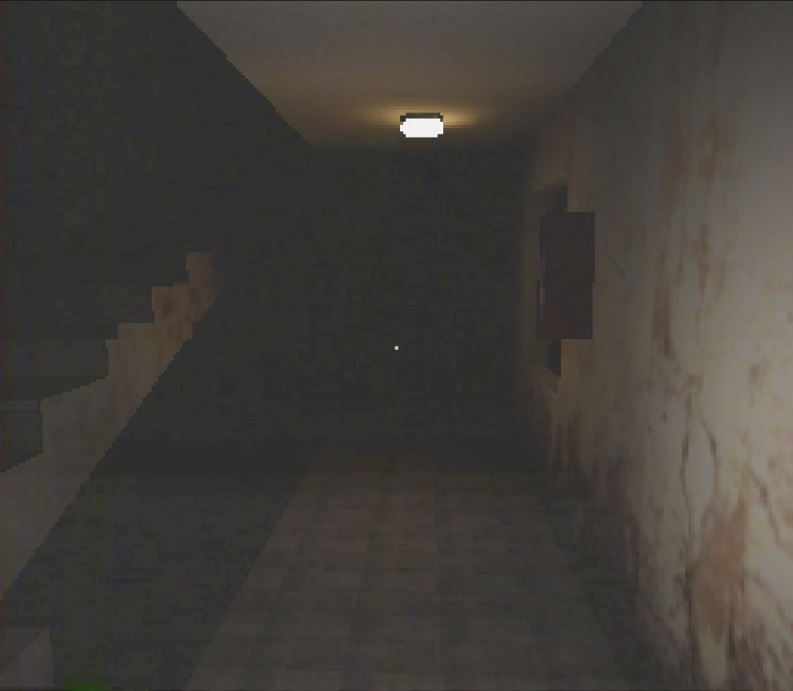
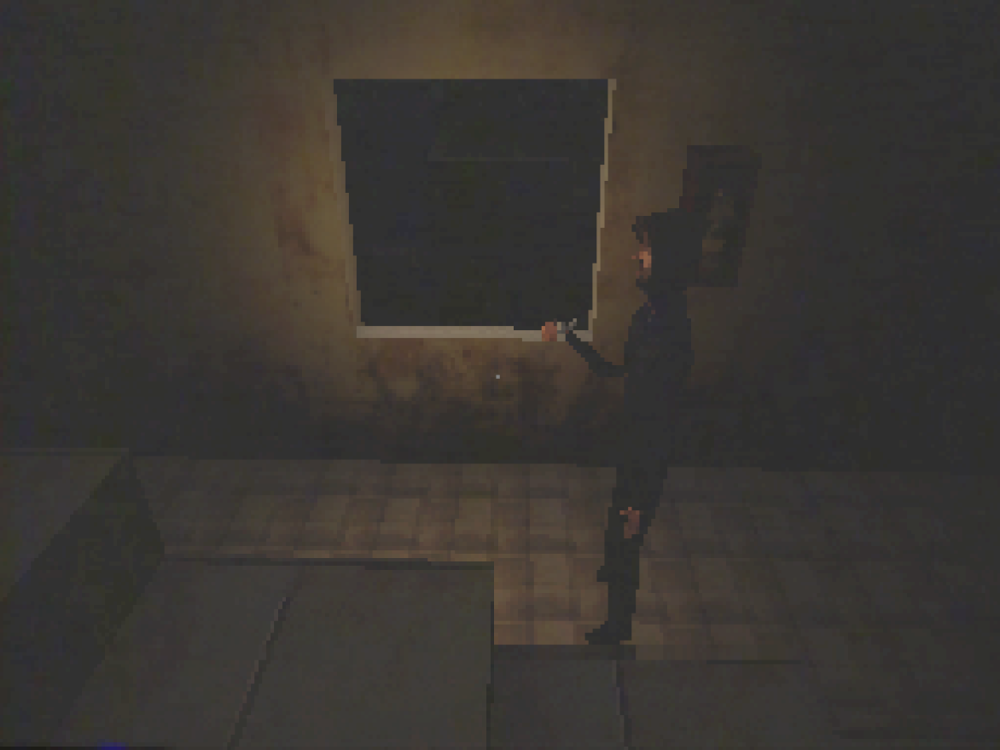
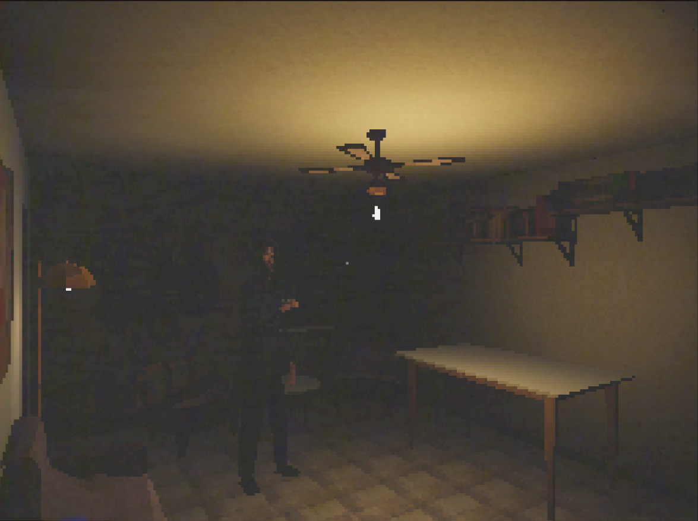
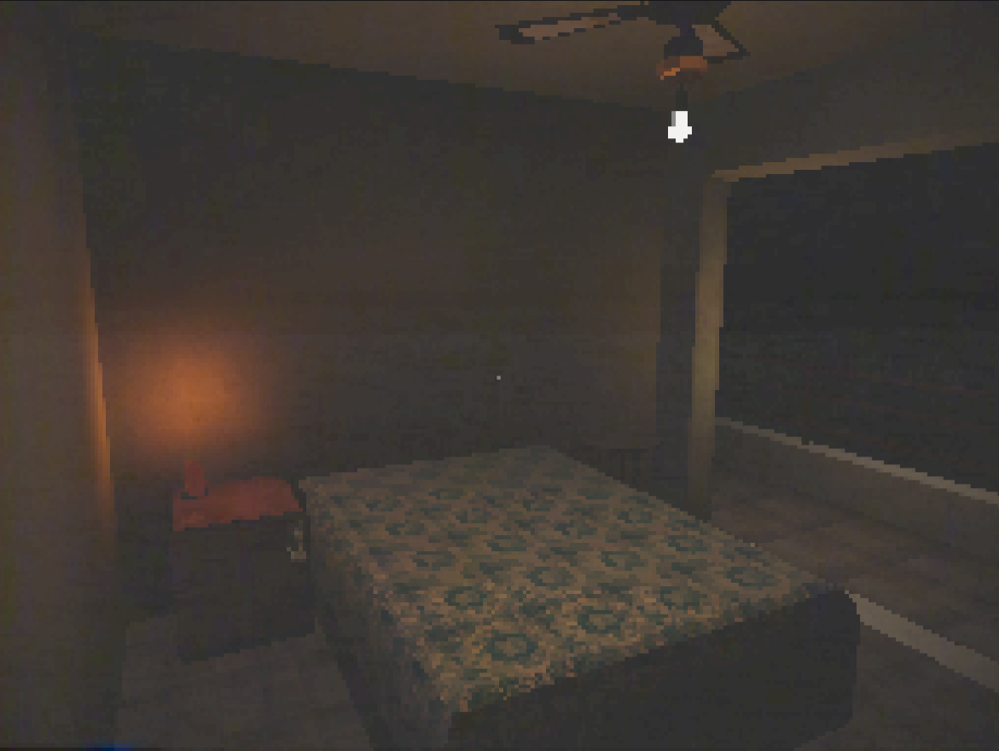

# MyHouse – Experimental Atmospheric Game

An experimental first-person horror experience set inside a reconstructed domestic space.

This project explores **atmosphere over mechanics**, focusing on lighting, spatial tension, and retro aesthetics inspired by early survival horror games.

---

## 🎥 Concept

MyHouse is not designed as a traditional game.
It is an **interactive atmosphere experiment**.

The objective is to recreate a familiar house environment and transform it into a space of tension through:

- Fixed cinematic cameras
- Minimalist interaction systems
- Stylized retro visuals
- Light as narrative device

The house is both memory and space.

---

## 🕯 Core Features

- First-person exploration
- Optional fixed camera system (inspired by classic survival horror)
- Lighter-based dynamic lighting system
- Drawer and cabinet interaction
- Retro-inspired post-processing
- Low-resolution textures for PS1 aesthetic

---

## 🛠 Built With

- **Unity 2021 (Built-in Render Pipeline)**
- Blender (3D modeling)
- Custom scripts in C#

---

## 🎮 Controls

| Action | Key |
|--------|------|
| Move | WASD |
| Interact | E |
| Toggle Lighter | F |
| Switch Camera Mode | (Configurable) |

---

## 🧠 Design Philosophy

The project follows a layered development structure:

1. Solid technical base  
2. Atmosphere and lighting  
3. Tension systems  
4. Minimal progression  
5. Polish  

The focus remains on coherence and mood rather than feature expansion.

---

## 🚧 Current Status

Core systems implemented.
Project entering refinement and expansion phase.

Planned additions:

- Inspection system
- Enemy presence mechanics
- Key and locked-door progression
- Short narrative arc (20–40 minutes experience)

---

## 📸 Screenshots

### Hallway

### Fixed Camera Mode

### Living Room

### Bedroom

---

## 📌 Author

Carlos Margara  
Independent experimental developer

---

## License

MIT License